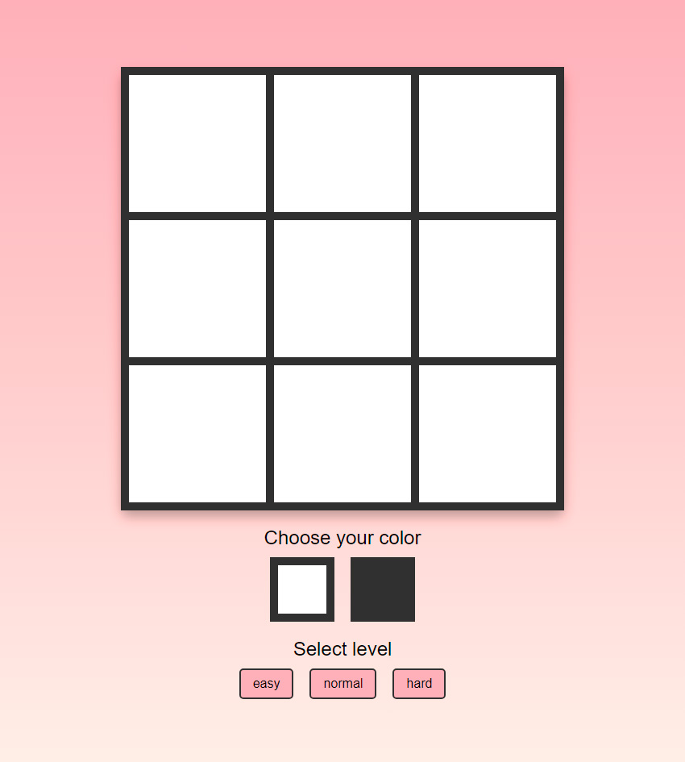

# Jogo da Velha (Tic-Tac-Toe) com IA

  

Este é um projeto de Jogo da Velha desenvolvido em JavaScript puro, HTML e CSS. O jogo permite que um jogador humano enfrente uma Inteligência Artificial (IA) com diferentes níveis de dificuldade.

## Funcionalidades Implementadas

- **Interface Gráfica Completa**: Tabuleiro interativo com design responsivo.
- **Seleção de Lado**: O jogador pode escolher jogar com as peças brancas ou pretas.
- **Múltiplos Níveis de Dificuldade**:
  - **Fácil**: A IA realiza jogadas aleatórias entre as casas disponíveis.
  - **Normal**: A IA utiliza o algoritmo Minimax com uma profundidade de busca limitada (2 jogadas à frente), oferecendo um desafio moderado.
  - **Difícil**: A IA utiliza o algoritmo Minimax com profundidade máxima, tornando-a um oponente imbatível.
- **Lógica de Jogo Robusta**: Detecção automática de vitória, derrota e empate.
- **Sistema de Fim de Jogo**: Exibição de uma mensagem modal informando o resultado da partida.
- **Opção de Reiniciar**: Um botão "Play Again" permite reiniciar o jogo, voltando à tela de seleção de cor e dificuldade.

## Como Jogar

Acesse <a href="https://lgjor.github.io/TicTacToe/" target="_blank">https://lgjor.github.io/TicTacToe/</a> e teste agora mesmo.

Ou se preferir, faça o clone do projeto e abra o `index.html` no navegador.

Como jogar:
0. Escolha a cor com a qual deseja jogar (branca ou preta).
1. Selecione o nível de dificuldade da IA (easy, normal, ou hard).
2. O jogo começará. Clique em uma célula vazia para fazer sua jogada.
3. O jogo termina quando um jogador vence ou quando todas as células são preenchidas (empate).
4. Clique em "Play Again" para começar uma nova partida.

## Estrutura do Projeto

O código é modularizado para separar a lógica do jogo da manipulação da interface.

*   `main.js`: Orquestra o jogo. Gerencia o estado (nível, cor, tabuleiro), captura os eventos do usuário (cliques) e controla o fluxo de turnos entre o jogador e a IA.
*   `engine/engine.js`: Contém a "inteligência" do jogo. Inclui as funções puras para verificar movimentos disponíveis, realizar jogadas, checar condições de vitória/empate e a implementação do algoritmo Minimax.
*   `ui/renderer.js`: Responsável por toda a manipulação do DOM. Atualiza a aparência do tabuleiro, exibe e esconde mensagens e reseta a interface visualmente.
*   `styles/index.css`: Contém todos os estilos para a aparência do jogo, incluindo o layout, cores, fontes e o modal de fim de jogo.

## Sugestões de Funcionalidades Futuras (Roadmap)

- [ ] Animações CSS nas células vencedoras (.win com keyframes)
- [ ] Undo de último movimento
- [ ] Suporte a teclado (setas + Enter)
